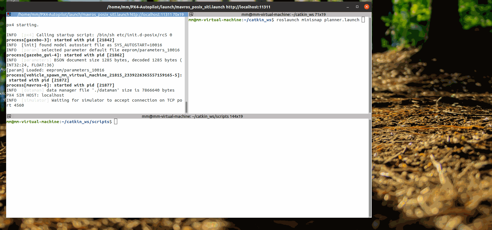

---

# Introduction

This project is based on ROS and Gazebo simulation. It utilizes the 3D Nav Goal in RVIZ to set target points. When there are three target points, a trajectory is planned using the minimum snap algorithm. The px4Ctrl subscribes to and receives trajectory messages to control the quadcopter to complete a flight. After reaching the destination, new target points can be set again.

---

# 1. Enviroments

Fundamental enviroment: Ubuntu20.04 + ROS noetic + gazebo11 + mavros + PX4&nbsp;
Partial dependency libraries: Eigen 3.3.7

# 2. How to use
* After starting mavros and PX4, run the "px4Ctrl.sh" script.
`sh scripts\px4ctrl.sh`
* Open a new terminal and launch the "planner.launch" file from the minisnap package.`roslaunch minisnap planner.launch`

# 3. Demonstration of the effect

